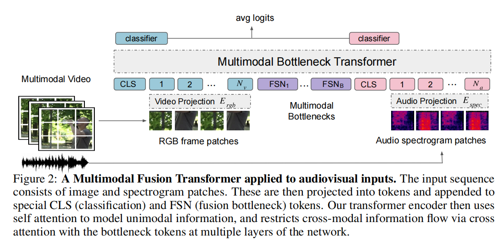
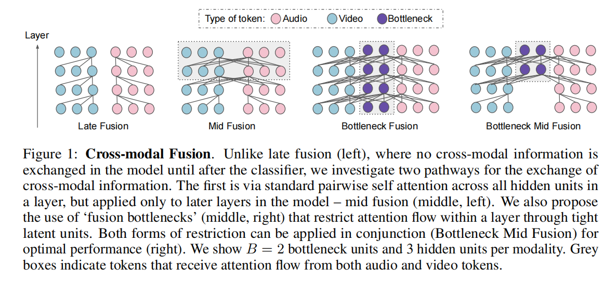
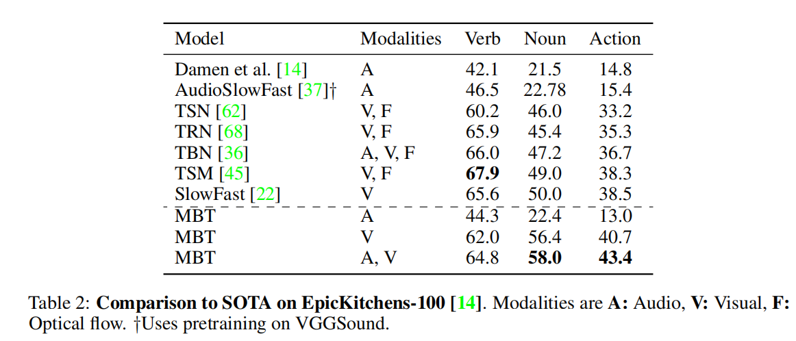

# Attention Bottlenecks for Multimodal Fusion
[[paper]](https://arxiv.org/abs/2107.00135)

## Introduce

本文介绍了一种新的基于Transformer的多模态融合架构，即多模态瓶颈变换器（MBT），用于音频和视频数据的融合。与以往在多模态视频分类中常用的“晚期融合”方法不同，MBT通过在多个层次上使用“融合瓶颈”来促进模态间的信息融合。这种设计要求模型在每个模态中筛选和压缩相关信息，然后仅共享必要信息，从而提高融合性能并降低计算成本。通过深入的消融研究，MBT在多个音视频分类基准测试中取得了最新进展，包括AudioSet、Epic-Kitchens和VGGSound等数据集。所有代码和模型将发布。

## Problems

1. 不同模态的表征差异有很大的不同，模态之间学习动态的差异，不同的噪声拓扑结构，某些模态流比其他模态流包含更多的任务信息，专门的输入表征。  
2. 后期融合(late fusion)开销会相对小一点，但是融合程度会低一点，而早期融合(early fusion)开销会相对大一点，但是融合程度会高一点
    > 很像cnn和transformer的关系，所以自然而然会想起有没有什么方式综合平衡这两种方式
## Method
### MFT

通过在两个模态分支之间添加FSN,迫使模型压缩精华信息。避免完全成对注意的二次缩放成本，从而以更少的计算量提高了性能

## Performance

