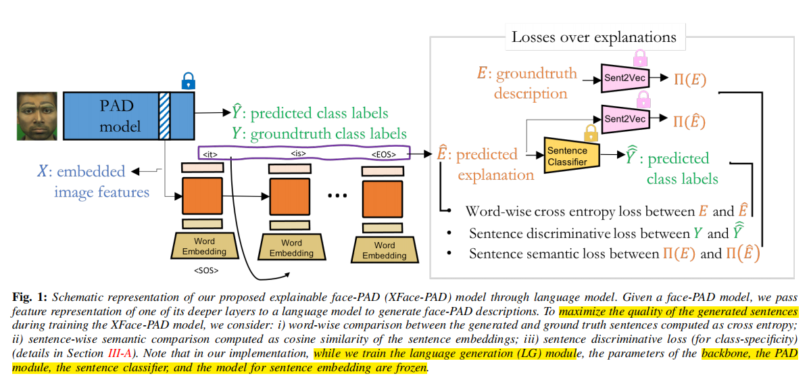
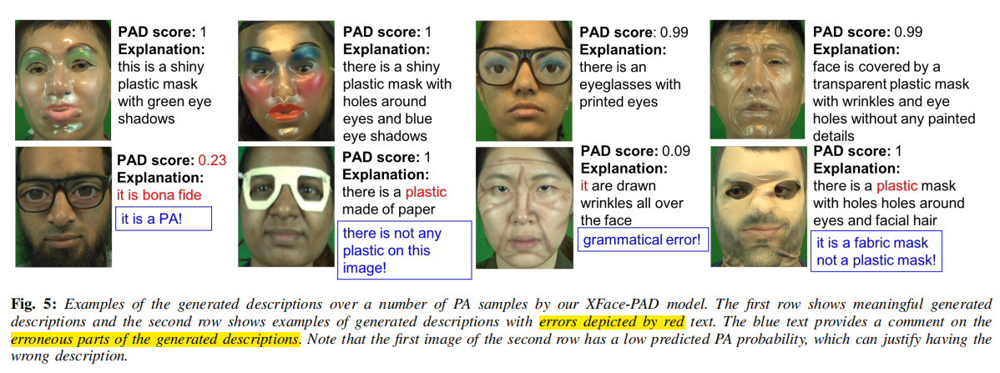

# Explaining Face Presentation Attack Detection Using Natural Language

[[paper](http://arxiv.org/abs/2111.04862)]

## Introduction

这篇论文提出了一种使用自然语言来解释面部呈现攻击检测（PAD）模型预测的方法。研究者利用轻量级LSTM网络生成描述PAD预测背后逻辑的文本，并研究了不同的损失函数来提高文本质量。通过在含有真实和攻击样本的数据集上的实验，验证了模型生成有效PAD解释的能力。

## Problems

尽管深度神经网络（DNN）在提高PAD性能方面取得了显著进展，但这些模型通常因为缺乏透明度和可解释性而受到批评。用户对模型的信任度取决于他们是否理解模型在各种情况下的行为，包括面对未知攻击和环境条件时。

## Method

核心方法是利用一个轻量级长短期记忆（LSTM）网络作为自然语言生成模型，该网络接收来自PAD模型深层的特征表示，并生成描述PAD预测背后推理过程的文本。为了提升生成文本的质量，研究者探索了多种损失函数，包括逐字交叉熵损失、基于BERT的句子语义损失，以及句子区分损失。在模型训练时，PAD模型的参数保持冻结，以确保不影响原有的PAD性能，而只针对语言生成模块进行训练。

## Performance

