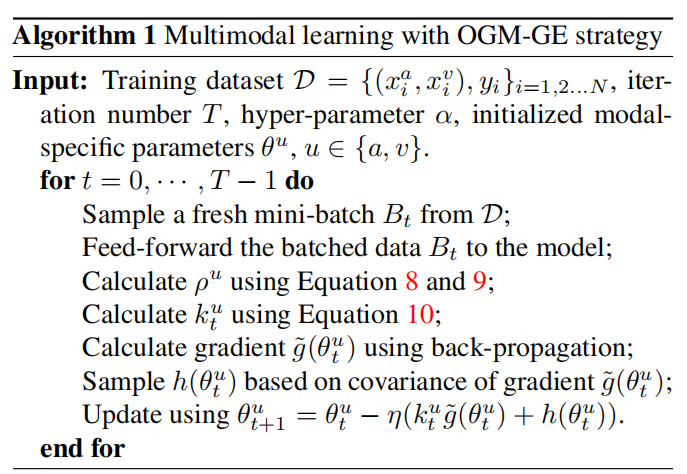
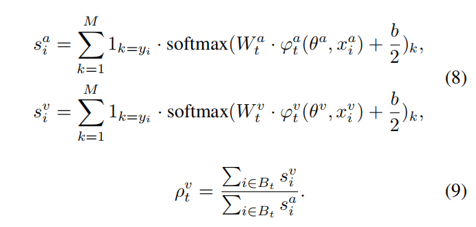
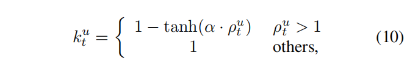
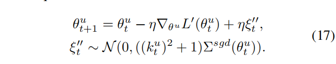
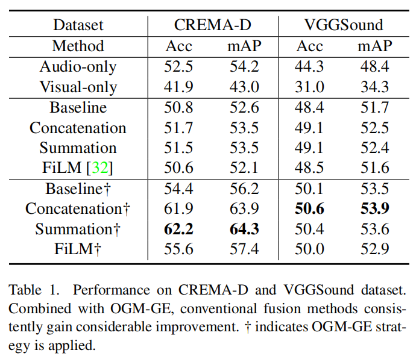
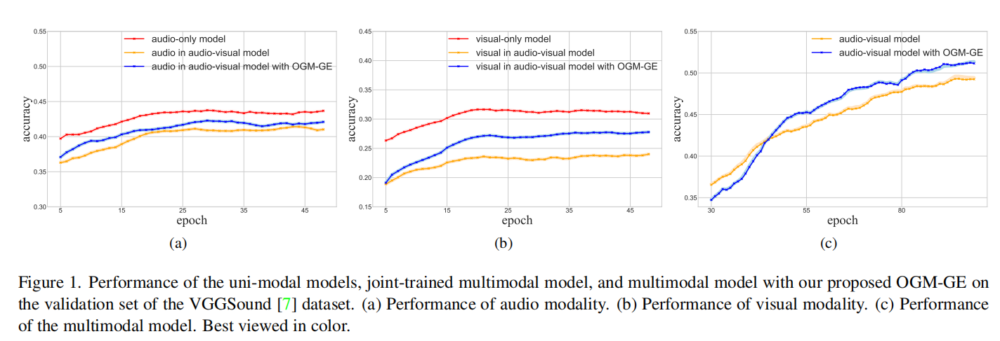

# Balanced Multimodal Learning via On-the-fly Gradient Modulation
[[paper]](https://link.zhihu.com/?target=https%3A//arxiv.org/abs/2203.15332)  [[code]](https://link.zhihu.com/?target=https%3A//github.com/GeWu-Lab/OGM-GE_CVPR2022)  

## Introduce

这篇论文提出了一种新的多模态学习方法，名为“On-the-fly Gradient Modulation with Generalization Enhancement (OGM-GE)”，旨在解决多模态学习中存在的优化不平衡问题。多模态学习通过整合不同感官的信息来全面理解世界，但现有的多模态判别模型在某些情况下可能无法充分利用多种输入模态，导致某些模态的表示未被充分优化。

## Problems
多模态框架中的单模态性能不如单模态框架中的单模态性能，某些情况下可能无法充分利用多种输入模态，导致某些模态的表示未被充分优化，多模态学习中存在的优化不平衡问题，起主导作用的模态会对另一个模态的优化起抑制作用。

## Method

### on-the-fly gradient modulation
对不同模态的Encoder用梯度计算其贡献率从而得到差异比率，再通过差异比率得到主导模态的梯度调节权重，来调节各模态的梯度关系

#### 公式

### generalization enhancement
> 定理：SGD 中的噪声与其泛化能力密切相关，SGD噪声越大，泛化能力越好。SGD 噪声的协方差与学习率和批量大小的比率成正比。

为了解决OGM 方法会使 SGD 的泛化性能下降的问题，给梯度中加入随机采样的高斯噪声

## Performance

