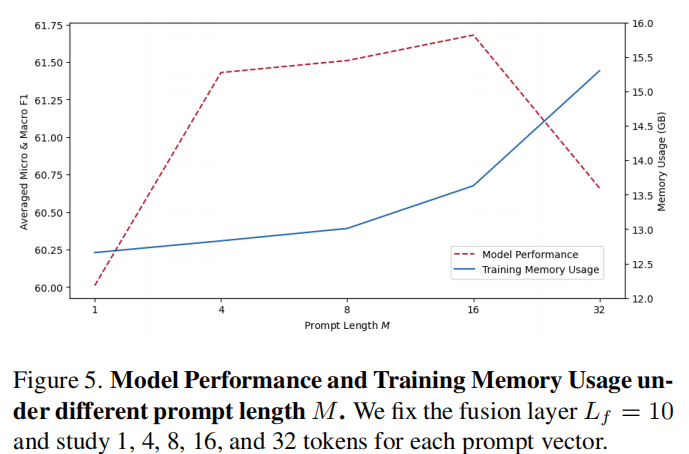

# Efficient Multimodal Fusion via Interactive Prompting

## Introduce

这篇论文提出了一种名为PMF（Prompt-based Multimodal Fusion）的高效多模态融合方法，通过在单模态预训练变换器的深层添加特定类型的提示向量，实现了在显著降低训练内存使用的同时，保持与全参数微调方法可比的性能。PMF方法通过模块化的多模态融合框架和三种不同类型的交互提示，增强了不同模态间的双向交互，展示了在多模态学习任务中的灵活性和高效性。

## Problems

1. **计算成本高昂**：传统的微调方法需要存储和更新多模态模型中所有参数的梯度和优化器状态，这导致了巨大的计算和内存开销。
2. **参数效率**：为了减少所需的计算资源，研究者们寻求比全参数微调更高效的参数更新方法。
3. **模态间的双向交互**：现有的一些多模态学习方法可能只支持单向的信息流，限制了不同模态间的全面交互和学习。
4. **内存效率**：尽管某些参数效率的方法减少了更新的参数数量，但在训练过程中的内存使用并没有得到足够的优化。

## Method

### PMF

1. **两阶段结构**：

   - **查询阶段**：此阶段的目的是提取每个模态中必要的信息，以便将其传递给另一个模态。通过使用查询提示（Query Prompts, QP）和查询上下文提示（Query Context Prompts, QCP），模型能够像提问和回答一样动态地学习不同模态间的信息交换。

   - **融合阶段**：在这个阶段，提取的信息通过非线性映射函数转换，并与另一个模态的原始输入序列和融合上下文提示（Fusion Context Prompts, FCP）结合，以完成信息的融合。这有助于改善跨模态理解。

     **灵活性和模块化**：两阶段结构允许模型更灵活地处理不同模态的信息，并且可以更容易地集成到不同的模型架构中。

     **双向交互**：这种结构支持不同模态之间的双向交互，有助于更全面地探索和利用多模态数据之间的关系，从而提高模型性能。

2. **提示解耦**：

   - **解耦学习目标**：通过将传统的单一提示分解为三种不同类型的提示，PMF能够更清晰地区分并专注于不同的学习目标，从而提高多模态学习的效果。
   - **内存效率**：通过仅在单模态变换器的深层添加提示向量，PMF显著减少了训练过程中梯度计算的内存需求，这使得大型预训练模型能够在内存有限的GPU上进行训练。
   - **参数效率**：尽管PMF减少了可训练参数的数量，但通过精心设计的提示结构和非线性映射，它仍然能够实现与全参数微调方法相当的性能。

   

## Performance

