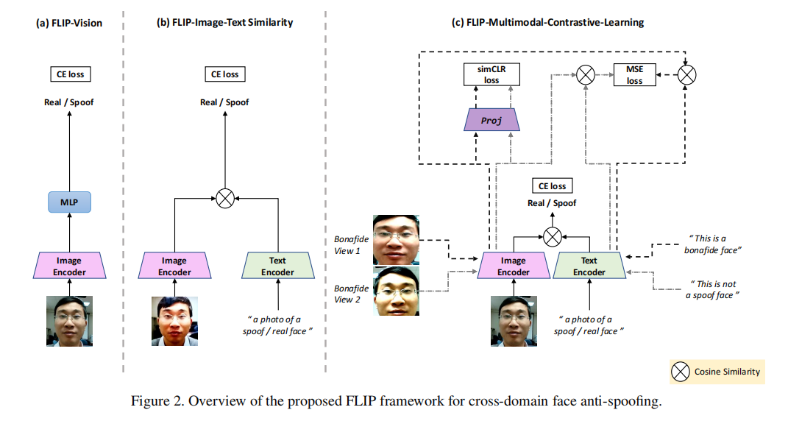
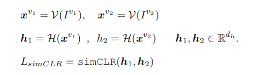
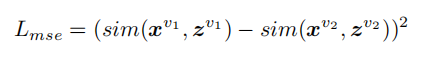
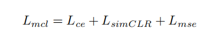
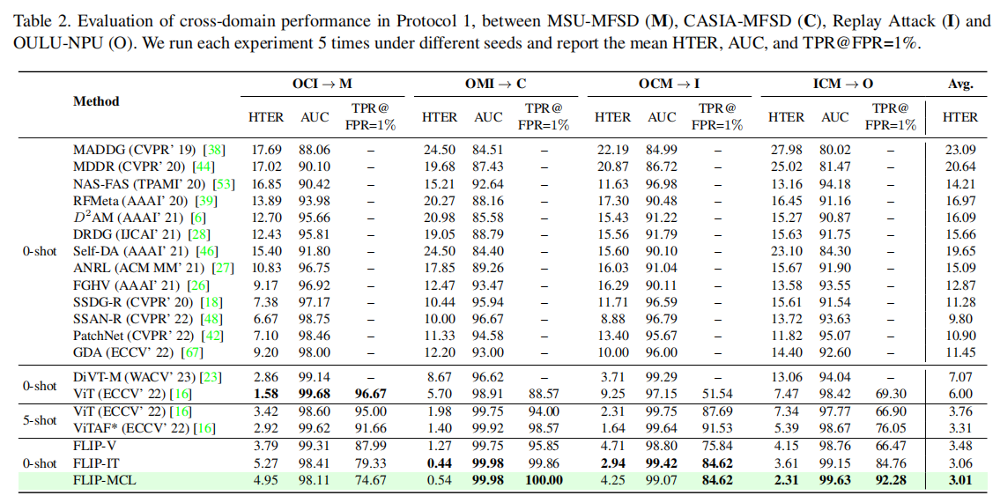

# FLIP  Cross-domain Face Anti-spoofing with Language Guidance

[[paper](http://arxiv.org/pdf/2309.16649v1)] [[code](https://github.com/koushiksrivats/FLIP)]

## Introduction

这篇论文介绍了一种名为FLIP的新型跨域人脸反欺骗（Face Anti-Spoofing, FAS）方法，该方法利用视觉变换器（Vision Transformer, ViT）模型和自然语言指导来提高FAS任务的泛化能力。研究者首先展示了使用多模态（例如CLIP）预训练权重初始化ViTs可以改善FAS任务的泛化性。接着，提出了一种新颖的跨域FAS方法，通过将图像表示与基于自然语言语义的类别描述集合对齐，在数据匮乏的情况下提高FAS的泛化能力。最后，提出了一种多模态对比学习策略，进一步增强特征泛化，并在源域和目标域之间架起桥梁。

## Problems

1. 与仅在图像上预训练的ViTs相比，使用多模态预训练的权值初始化ViTs是否能导致更好的跨域FAS性能?
2. 除了利用VLP模型的图像编码器外，文本编码器也可以用来提高FAS的泛化性能吗？
3. 在FAS任务的VLP模型的适应过程中，利用自我监督技术，能否克服FAS中巨大的领域差距和有限的训练数据可用性？

## Method

###  Contrastive Language-Image Pre-Training

CLIP模型使用对比损失来训练，这种损失函数旨在最大化图像和文本嵌入之间的余弦相似度，同时最小化错误配对的余弦相似度。这意味着模型学习将匹配的图像和文本对拉近，而将不匹配的对推远。

### FLIP-Multimodal-Contrastive-Learning

在FLIP-MCL中，除了标准的交叉熵损失外，还使用了simCLR（一种对比学习框架）损失来增强特征的泛化性。simCLR损失通过创建输入图像的两个不同视图（通过不同的数据增强技术），并确保这两个视图的特征表示在模型学习过程中保持一致。

### FLIP-Image-Text Similarity

FLIP-IT中，图像表示（由图像编码器提取）与每个类别对应的文本表示计算余弦相似度。对于批次中的每张图像，都会得到两个相似度值，分别对应真实和欺骗类别。

## Performance

