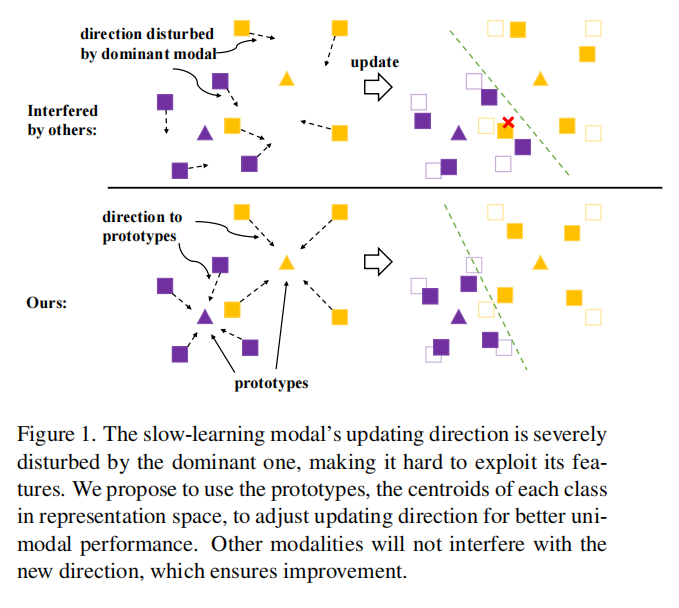
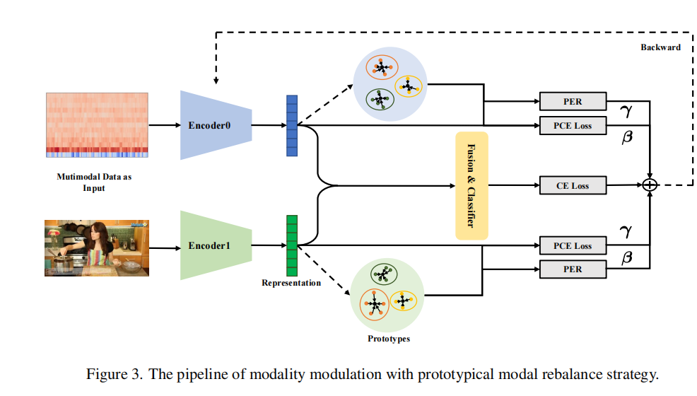
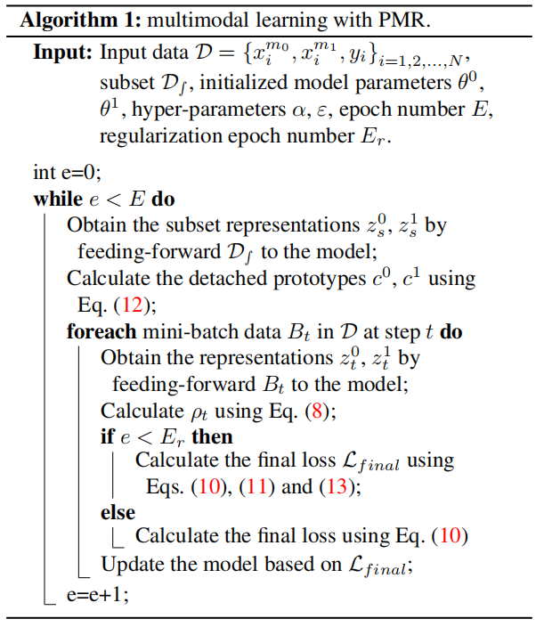
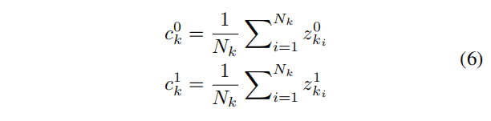
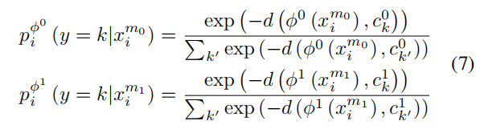
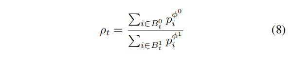
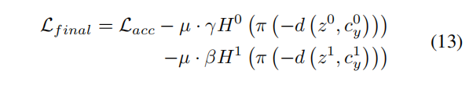
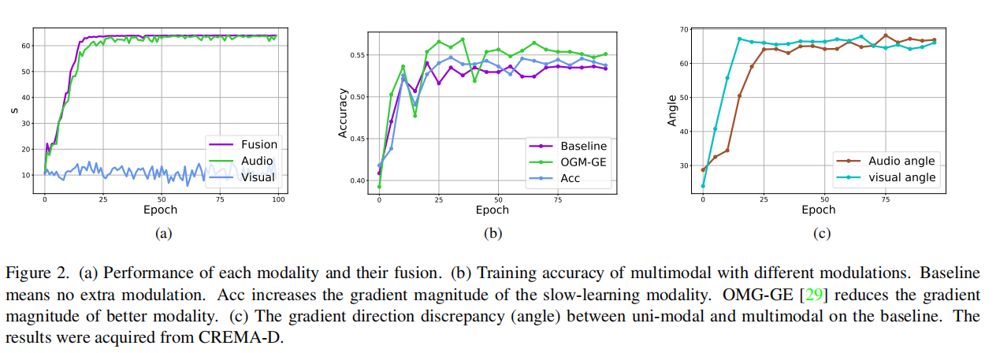
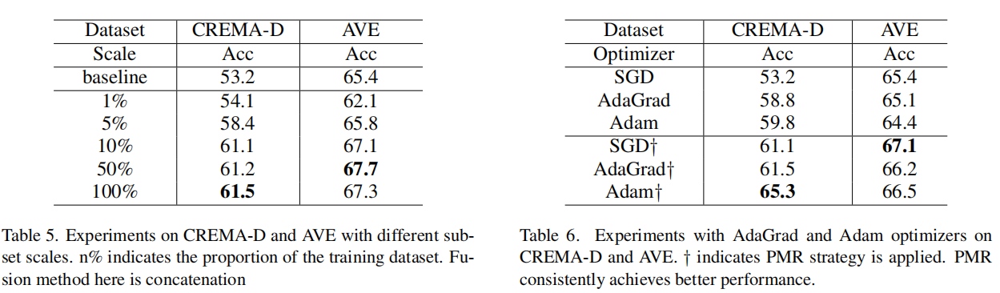

# PMR: Prototypical Modal Rebalance for Multimodal Learning

[[paper]](http://arxiv.org/pdf/2211.07089) [[code]](https://github.com/fanyunfeng-bit/Modal-Imbalance-PMR)

## Introduce

这篇论文提出了一种名为PMR（Prototypical Modal Rebalance）的新方法，用于解决多模态学习（MML）中的模态不平衡问题。模态不平衡是指在多模态学习过程中，一个表现更好的模态可能会抑制另一个表现较差的模态的学习，从而影响整体性能。PMR的目标是通过特定的策略激发学习速度较慢的模态，并减轻由主导模态带来的抑制效应。

## Problems

现有的MML方法通常针对不同模态优化统一的目标，导致臭名昭著的“模态不平衡”问题和适得其反的MML性能

## Method

一方面加速慢速模态收敛，一方面抑制快速模态收敛

### PMR

### PCE

利用原型中心进行梯度修正，通过增强慢学习模态的聚类过程来加速其学习，不受其他模态干扰。

### PER

在训练早期阶段引入，用于减缓主导模态的收敛速度，以减轻对其他模态的抑制。

## Performance

