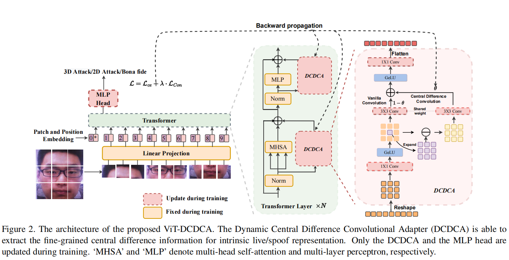
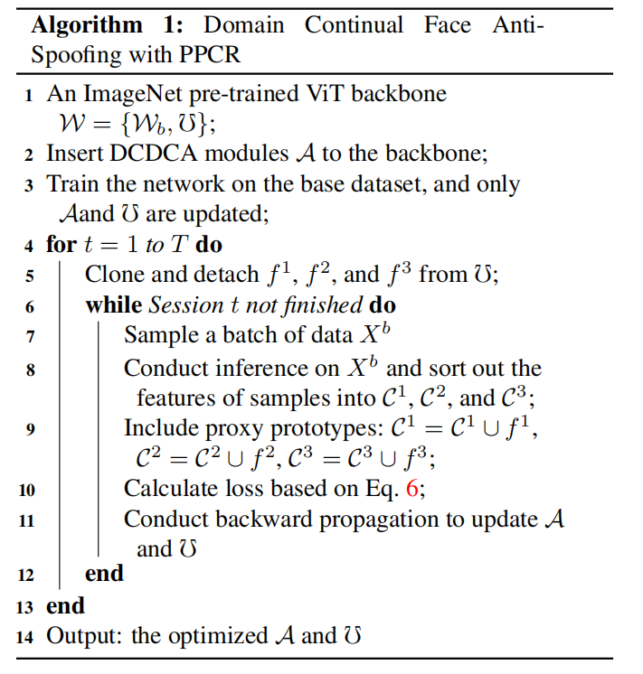
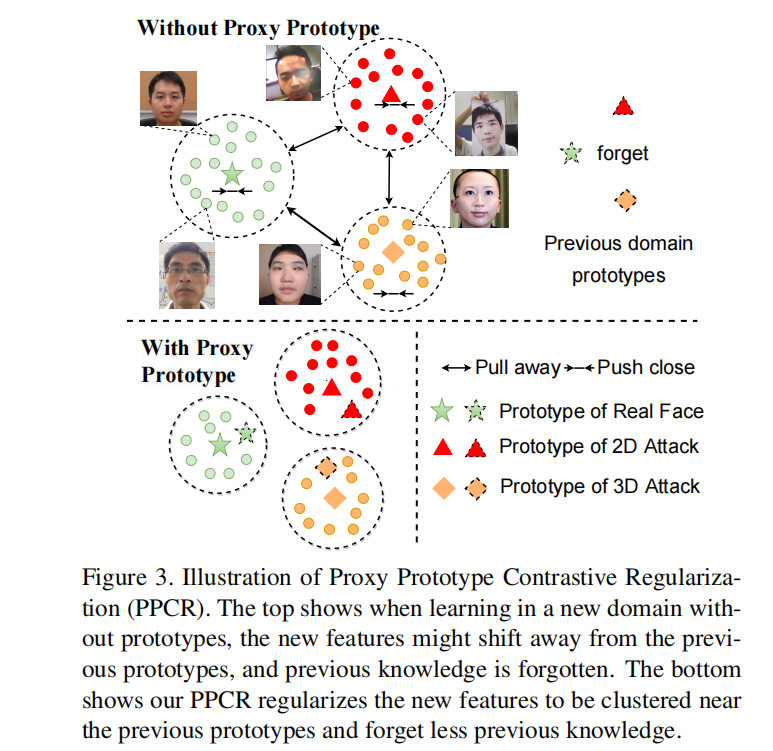
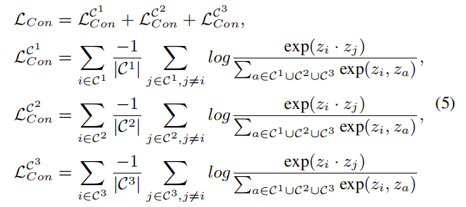
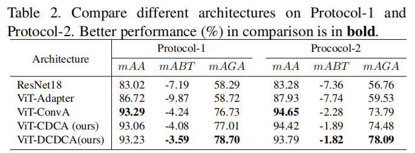

# Rehearsal-Free Domain Continual Face Anti-Spoofing: Generalize More and Forget Less

[[paper]](https://ieeexplore.ieee.org/document/10377773) [[code]](https://github.com/RizhaoCai/DCL-FAS-ICCV2023)

## Introduce

这篇论文提出了一种无需重放缓冲区的领域持续学习(DCL)方法，用于面部反欺骗(FAS)任务，通过设计动态中心差分卷积适配器(DCDCA)和代理原型对比正则化(PPCR)来提高模型在未见领域的泛化能力并减少对先验知识的灾难性遗忘。

## Problems

1. 灾难性遗忘问题
2. 域泛化问题

## Method

### DCDCA

将中心差分卷积中的$\theta$变成可学习参数实现动态自适应化，提高适应能力。

### PPCR

利用对比正则提高泛化能力，利用原型替代原本数据，避免记忆重放

## Performance

