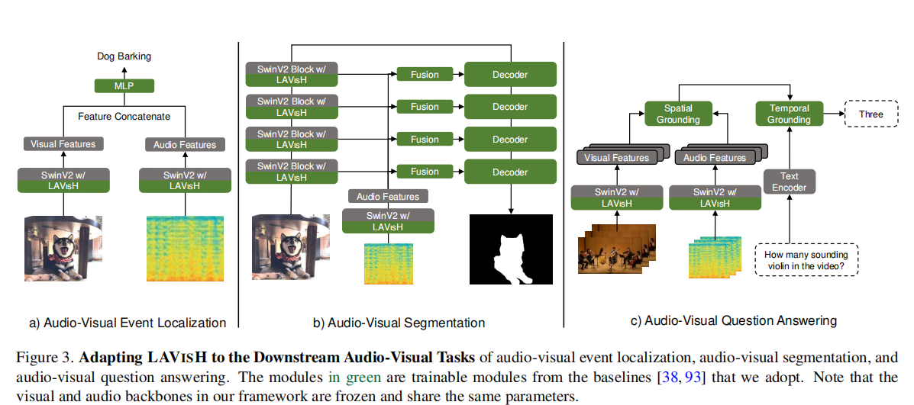
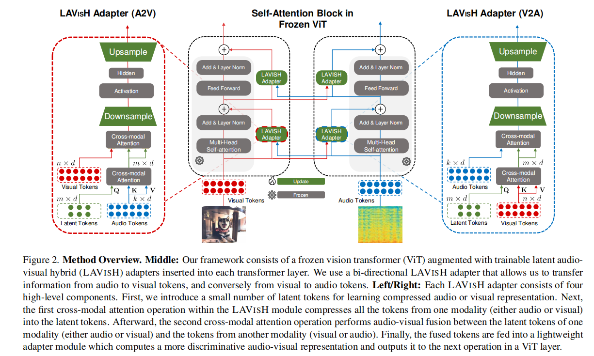
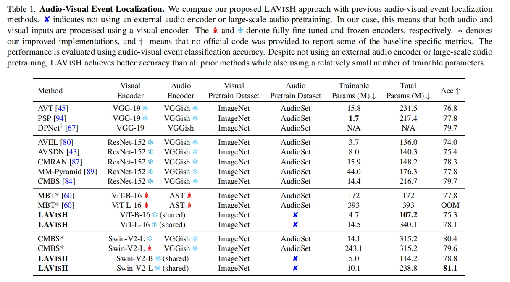

#  Vision Transformers are Parameter-Efficient  Audio-Visual Learners
[[paper]](https://arxiv.org/abs/2212.07983) [[code]](https://github.com/GenjiB/LAVISH)

## Introduce
这篇论文提出了一个名为LAVISH的新型适配器，它能够使预训练的ViTs在不需要对其原始参数进行微调的情况下，通过注入少量可训练参数来适应音视频任务。LAVISH适配器利用一组小的隐tokens形成注意力瓶颈，有效融合视觉和听觉线索，避免了标准交叉注意力的二次成本。

## Method

###  LAVISH Adapters
1. latent tokens 和 audio tokens的跨模态注意力模块用于压缩tokens
    > 这里的描述是尝试少参量来压缩，从而让其学习到最重要的信息。与autoencoder一致 
2. visual tokens和压缩tokens的跨模态注意力模块
    > 分成两个跨模态注意力模块是为减少计算开销
3. 轻量级adpater模块

    > 这里结构设计体现出的是让audio去对齐visual的思路
## Performance

