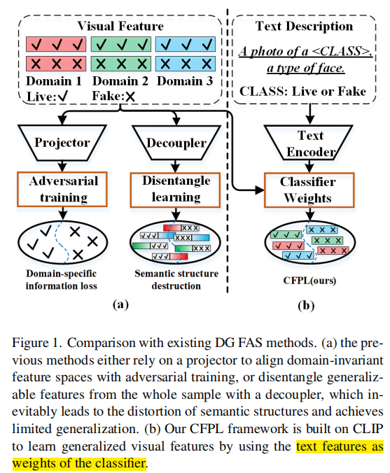
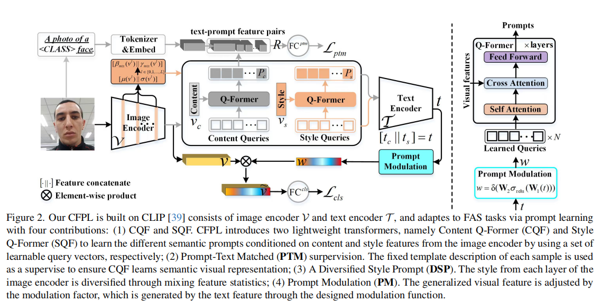
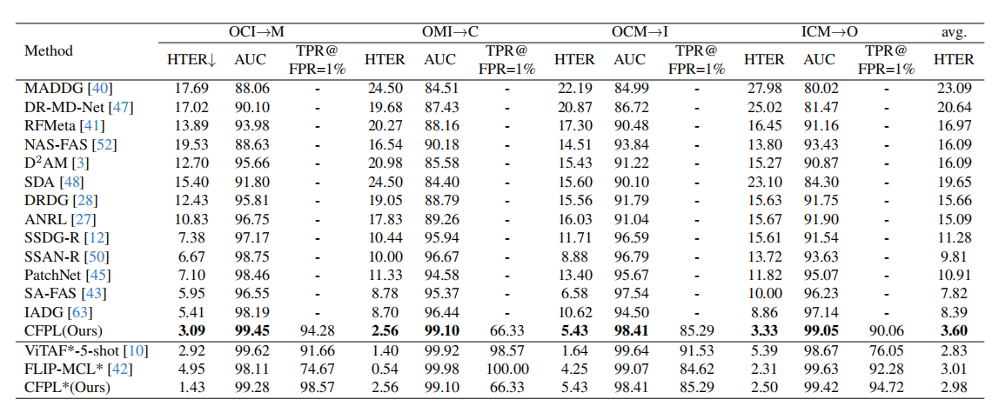

# CFPL-FAS: Class Free Prompt Learning for Generalizable Face Anti-spoofing

[[paper](https://arxiv.org/abs/2403.14333)]

## Introduction

本文提出了一种无需类别标签的提示学习范式（CFPL），用于改善在未知领域中面部反欺骗（FAS）模型的性能。该方法利用大规模视觉-语言模型（如CLIP）和文本特征动态调整分类器权重，以探索通用的视觉特征。CFPL通过两个轻量级变换器Content Q-Former (CQF)和Style Q-Former (SQF)来学习基于内容和风格特征的不同语义提示，并引入了Prompt-Text Matched (PTM)监督和多样化风格提示（DSP）技术来优化这些提示的学习。最终，通过设计的Prompt Modulation (PM)功能，将学习到的文本特征调节视觉特征以实现泛化。广泛的实验表明，CFPL框架有效且在多个跨领域数据集上超越了现有最先进方法。

## Problems

现有的FAS方法通常依赖领域标签来对齐领域不变特征空间，或者从整个样本中分离出通用特征，这些方法不可避免地会导致语义特征结构的失真，并且泛化能力有限。

## Method

### CFPL

提出了一种新颖的类无关提示学习范式（Class Free Prompt Learning, CFPL）,CFPL首先从图像编码器的输出中提取内容（content）和风格（style）特征。内容特征反映了图像的本质属性，而风格特征则包含了图像的实例特定样式信息。

### CQF&SQF

两个轻量级Transformer：Content Q-Former（CQF）和Style Q-Former（SQF），用于分别基于内容和风格特征学习不同的语义提示。

> MixStyle

### PTM

通过固定模板描述为每个样本生成文本描述，并确保CQF学习到的视觉表示能够最大程度地反映内容描述的信息。

### DSP

通过混合实例特定风格之间的特征统计数据，多样化风格提示的学习。

### PM

使用文本特征通过设计的调制函数来调节视觉特征，以实现泛化。

## Performance

