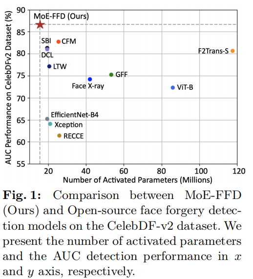

# MoE-FFD: Mixture of Experts for Generalized and Parameter-Efficient Face Forgery Detection

## Introduce

本文介绍了一种名为MoE-FFD（Mixture of Experts for Face Forgery Detection）的新型深度伪造检测方法，该方法通过结合轻量级LoRA（Low-Rank Adaptation）和Adapter层，以参数高效的方式更新并保持Vision Transformer（ViT）骨干网络的ImageNet权重固定，同时利用Transformer的表达能力和CNN的局部先验来提取全局和局部伪造线索。MoE-FFD设计了新颖的MoE模块，通过固定激活参数动态选择最优的伪造检测专家，从而提高检测性能，并通过大量实验验证了其在减少参数开销的同时实现最先进的面部伪造检测性能。

## Problems

## Method

### Finetune

利用LoRA微调的全局特征提取能力和Adapter层卷积旁路的局部特征提取能力结合，综合提取特征来增强泛化性和鲁棒性。

### MoE

其中用混合专家网络来提升模型性能,通过不同的卷积算子组成的专家网络来捕获不同的欺骗特征

## Performance

