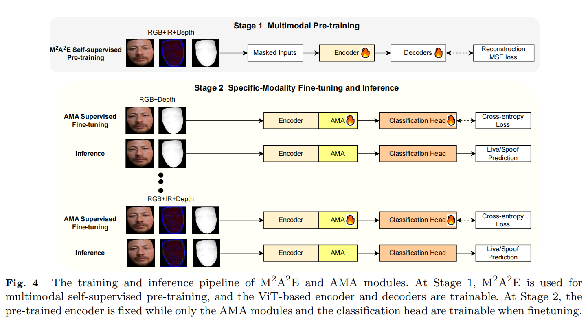
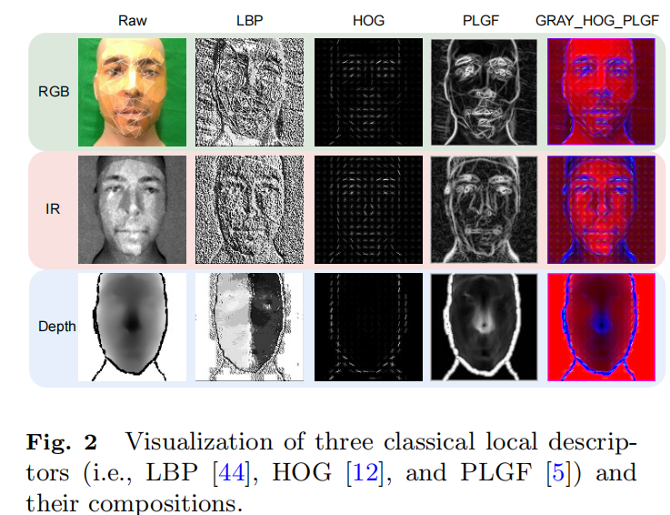
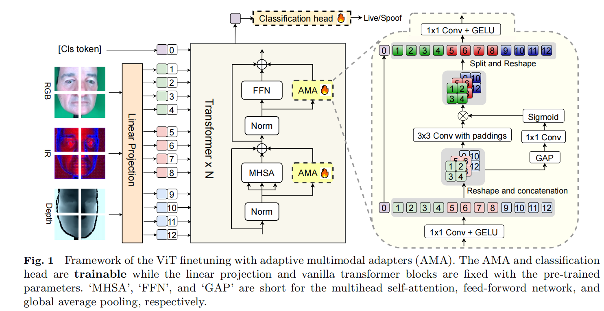
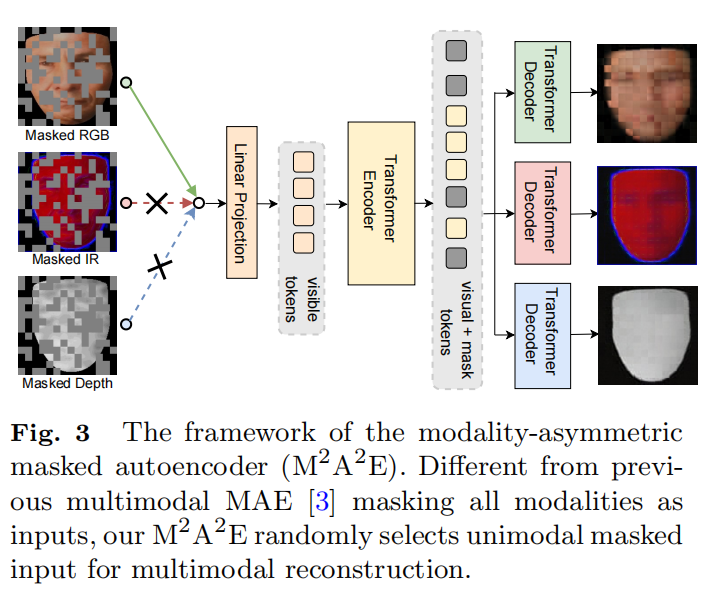
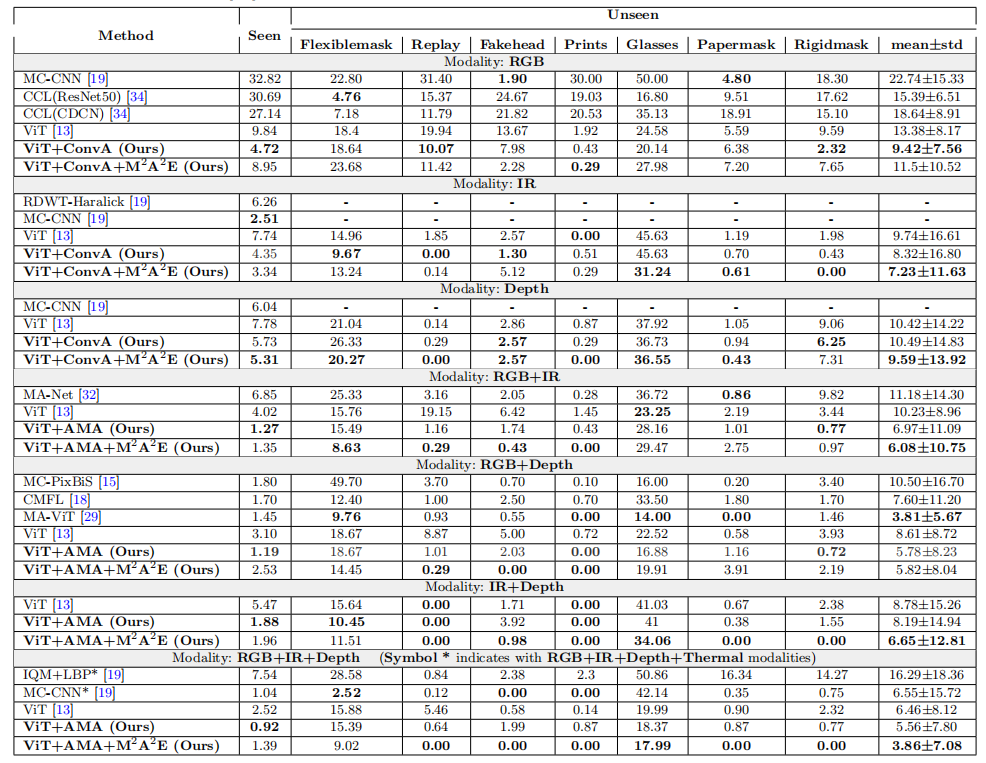

# Rethinking Vision Transformer and Masked Autoencoder in Multimodal Face Anti-Spoofing

[[arxiv]](https://arxiv.org/abs/2302.05744)

## Introduce

这篇论文提出了一种改进的视觉变换器（ViT）基础的多模态学习方法，用于提高人脸识别防欺骗系统的性能。研究主要关注三个关键因素：模态感知输入、多模态预训练和微调策略。通过设计一种新的自适应多模态适配器（AMA）和模态不对称掩码自编码器（M2A2E）进行自监督预训练，文章成功提升了模型在RGB、红外（IR）和深度图像模态下的鲁棒性，尤其是在缺少某些模态信息的情况下。实验结果表明，该方法在单模态和多模态设置下均优于现有技术，为未来基于ViT的多模态FAS研究提供了新的方向。
## Method
### 有效的红外模态的局部描述子
原始ViTs对光照敏感且忽略了局部细粒度线索

LBP对精细纹理和光照不变性的特点有助于FAS的泛化和鲁棒性

HOG对几何与光照的不变性的特点有助于光照敏感的模态的鲁棒性

PLGF这有助于减少光照/噪声变化的影响，同时保留基于边缘的低层次线索。

### AMA 微调多模态ViTs 

为网络注入FAS的领域知识。基于 FC 的Adapter侧重于token内特征的细化，但忽略了来自本地相邻token的上下文特征和来自跨模态token的多模态特征。所以采用卷积形式多模态版本的适配器。

> 可以参考transfomer和conv 的结合网络，核心就在于平衡transfomer关注全局特征而计算量大，conv关注局部特征而计算量小的特点。

### M2A2E训练一个预训练通用多模态模型

为了改良直接imagenet预训练权重的效果低下，提供更多多模态知识。

将不同模态数据混合在一起单独喂入，加上掩码后重建回所有模态

> 只喂入单模态但是重建全模态时采用MSE Loss可能导致Encoder更倾向于学习全模态的一致性特征而不是各模态的差异性特征

## Performance

