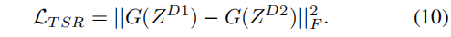

# S-Adapter: Generalizing Vision Transformer for Face Anti-Spoofing with Statistical Tokens

[[paper]](https://link.zhihu.com/?target=http%3A//arxiv.org/abs/2309.04038v1)

## Introduce

这篇文章介绍了一种名为S-Adapter的新型面部反欺骗（Face Anti-Spoofing, FAS）方法，该方法通过在预训练的Vision Transformer（ViT）模型中插入适配器模块来提高面部识别系统的安全性。S-Adapter通过提取局部统计信息和使用Token Style Regularization（TSR）来减少跨域风格差异，从而增强模型在不同领域间的泛化能力。实验结果表明，该方法在零样本和少样本跨域测试以及未见攻击检测方面，相较于现有技术，取得了显著的性能提升。

## Problems

- 域泛化问题
- 线性适配器局限性

## Method

### S-Adapter

使用统计信息来增强Adapter的泛化能力。首先提取token图，接着提取token直方图。

### TSR

利用Gram矩阵的风格表示，并且视所有真人为同一域，风格特征应该一致

## Performance

