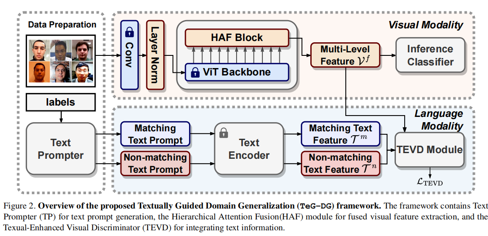
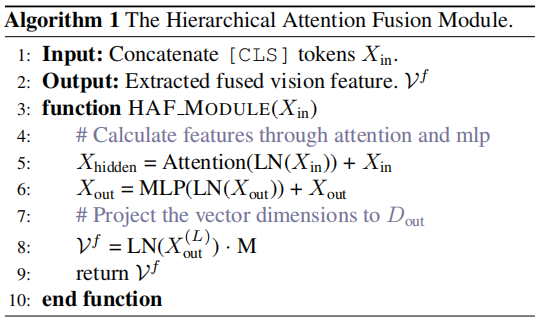
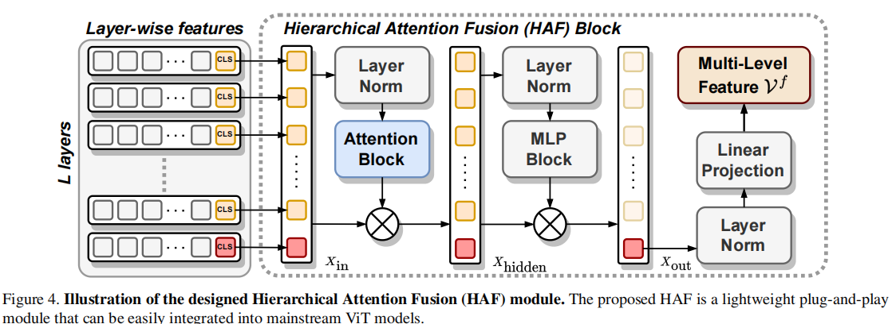
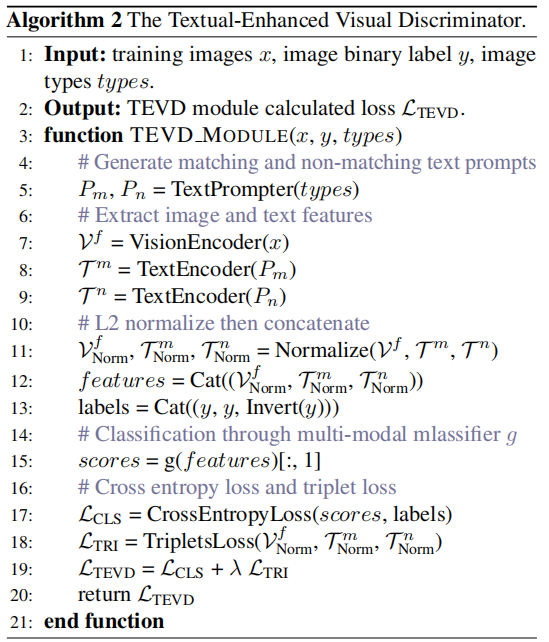
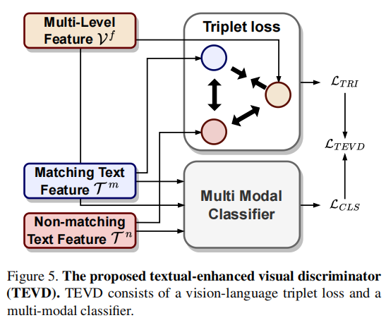
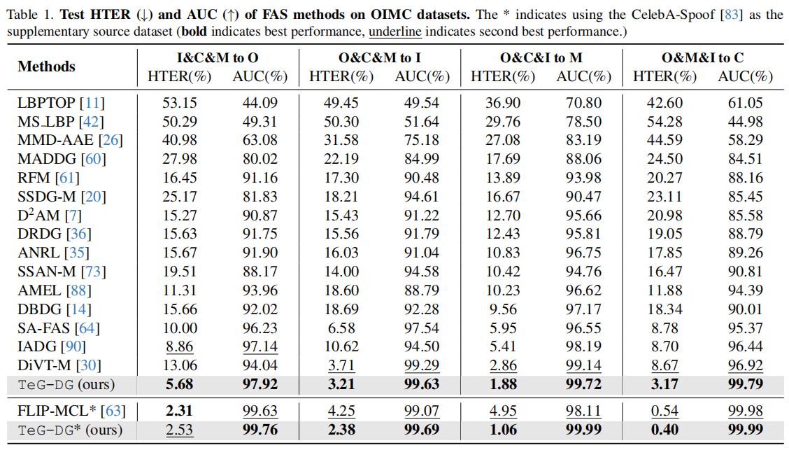

# TeG-DG: Textually Guided Domain Generalization for Face Anti-Spoofing

[[paper](http://arxiv.org/abs/2311.18420v2)]

## Introduce

这篇论文提出了一个名为TeG-DG（Textually Guided Domain Generalization）的新框架，旨在提升面部反欺骗（Face Anti-Spoofing, FAS）技术在不同领域中的泛化性能。通过利用文本信息实现跨领域对齐，TeG-DG框架设计了一个分层注意力融合（Hierarchical Attention Fusion, HAF）模块来自适应地聚合不同层级的视觉特征，并引入了一个文本增强视觉鉴别器（Textual-Enhanced Visual Discriminator, TEVD），以改善两种模态间的对齐并使用无偏文本特征来规范分类器。实验结果表明，TeG-DG在各种数据集上均优于现有方法，尤其是在源领域数据极其有限的情况下，展现了出色的小样本（few-shot）性能。

## Problems

1. 面部反欺骗（Face Anti-Spoofing, FAS）任务中不同攻击类型可能在不同粒度级别上影响特征的问题。这个问题的挑战在于，某些攻击（如视频重放攻击）可能在图像的低级纹理特征上引起显著变化，而其他攻击（如打印或掩模攻击）则可能改变图像的高级语义特征

## Method

### HAF

HAF模块的方法是自适应地合并输入图像的局部纹理特征和整体语义。具体来说，HAF通过视觉变换器（Visual Transformer）获取图像的层级特征，然后利用自注意力块（self-attention block）和多层感知器（MLP block）来融合不同层的[CLS]令牌，从而实现特征的自适应合并。这个过程包括层归一化（Layer Normalization, LN）来减少域变化引起的内部协变量偏移，随后通过线性投影对特征进行对齐，以及使用多头自注意力机制来计算注意力得分并融合特征。

### TEVD

TEVD（Textual-Enhanced Visual Discriminator）旨在解决的问题是如何有效地将文本信息整合到面部反欺骗（Face Anti-Spoofing, FAS）任务的训练过程中，以提高模型在未知领域的泛化能力。

TEVD的方法包括以下几个关键部分：

1. **视觉-语言三元组损失（Vision-Language Triplet Loss）**：利用文本特征作为视觉特征的监督，指导模型过滤掉视觉表示中的固有噪声和特定于域的特征（例如照明、背景）。通过三元组损失，模型学习将真实面部特征紧凑化，并将攻击图像的特征与真实面部特征区分开，从而提高模型对未知域的泛化能力。
2. **多模态分类器（Multi-Modal Classifier）**：设计一个多模态分类器，同时对视觉表示以及相应的匹配和不匹配文本提示特征进行分类。这个分类器丰富了视觉特征空间的表示，并与文本表示特征空间对齐，有助于模型基于跨域一致的特征做出合理判断，并自动丢弃可能存在于视觉表示中的噪声或特定于域的细节。

## Performance

