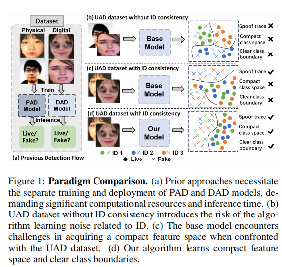

# Unified Physical-Digital Face Attack Detection

[[paper](http://arxiv.org/abs/2401.17699v1)]

## Introduction

这篇文章提出了一个名为UniAttackDetection的统一物理-数字面部攻击检测框架，用于识别面部识别系统中的物理攻击（如打印照片）和数字攻击（如DeepFake）。作者首先指出现有研究通常独立处理这两种攻击，导致需要部署多个模型和更高的计算负担。为解决这个问题，作者收集并发布了一个包含1800个参与者的29,706个视频的统一物理-数字攻击数据集UniAttackData，涵盖2种物理攻击和12种数字攻击。接着，提出了基于视觉-语言模型（VLMs）的UniAttackDetection框架，包含三个主要模块：教师-学生提示（TSP）模块、统一知识挖掘（UKM）模块和样本级提示交互（SLPI）模块，这些模块共同构成一个强大的统一攻击检测框架。通过在UniAttackData和其他三个数据集上的广泛实验，证明了该方法在统一面部攻击检测任务中的优越性。

## Problems

现有研究通常将这两种攻击的检测视为独立的任务，导致需要部署和训练多个模型，从而增加了计算资源的需求和推理时间

## Method

### TSP

TSP（Teacher-Student Prompts）模块是UniAttackDetection框架中的关键组成部分，它引入了一种新颖的学习机制，通过结合教师提示和学生提示来提取和学习统一的以及特定于类别的知识。教师提示利用预设的模板来引导模型捕捉不同攻击类型间共有的语义特征，而学生提示则是一组可学习的向量，它们通过最小化特定类别的分类误差来获得对特定攻击类型的强学习能力。这种设计不仅帮助模型学习到攻击检测任务中的通用知识，还使其能够适应并精确识别各种具体的攻击类型。通过这种方式，TSP模块增强了模型对不同攻击模式之间细微差别的识别能力，从而在统一攻击检测任务中实现更高的准确性和鲁棒性。

### UKM

UKM（Unified Knowledge Mining）模块是UniAttackDetection框架的核心，旨在通过统一特征挖掘（UFM）损失函数来加强模型对完整特征空间的学习。该模块利用自注意力编码器和多层感知器（MLP）构成的融合块来提取教师提示和学生提示之间的融合特征，确保学生特征紧密地接近教师锚点，从而学习到紧凑且完整的特征表示。通过这种方式，UKM不仅提升了模型对不同攻击类型的泛化能力，还增强了对特定攻击类型的识别精度，显著提高了统一面部攻击检测的性能。

### SLPI

SLPI（Sample-Level Prompt Interaction）模块是UniAttackDetection框架中负责样本级语义理解的关键部分，旨在通过多模态提示学习增强模型对视觉数据中实例级特征的把握。该模块通过交互投影器将可学习的学生提示映射到视觉嵌入空间，实现文本提示与视觉特征的交互。具体来说，学生提示作为可学习的文本标记被嵌入到文本编码器中，然后通过交互投影器，这些文本标记被映射到与视觉嵌入相同维度的空间，形成视觉-文本混合嵌入。这些混合嵌入随后与CLIP的图像编码器处理得到的图像特征相结合，使得模型能够在学习过程中同时考虑视觉信息和与之相关的文本信息。通过这种方式，SLPI模块不仅促进了学生提示对视觉样本中特定实例语义的动态理解，还使得视觉特征提取在文本的指导下更加深入，从而提升了模型对于复杂攻击模式的检测能力，确保了在统一攻击检测任务中对样本级细节的敏感性和准确性。

## Performance

