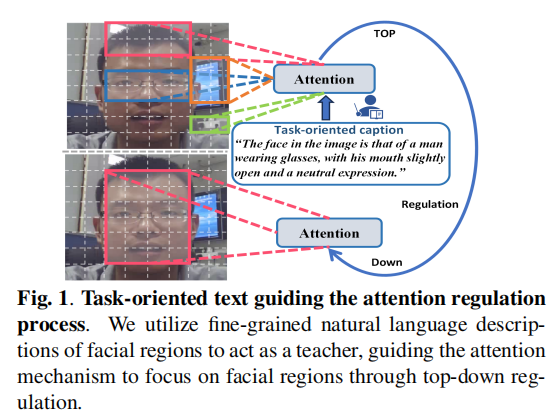
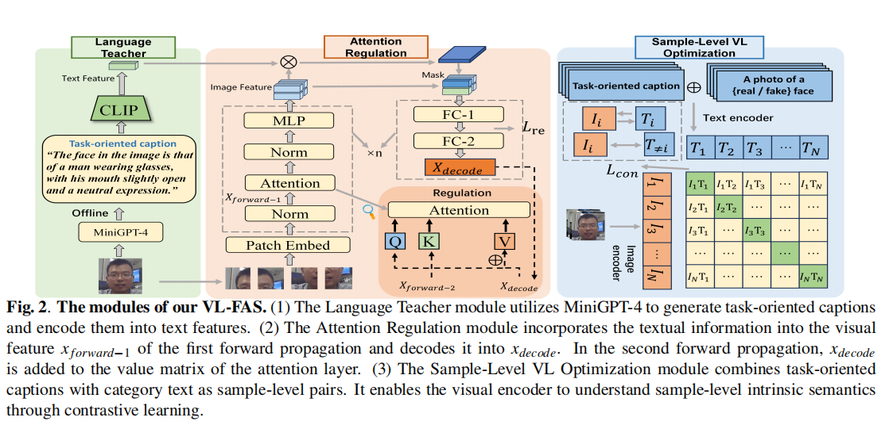
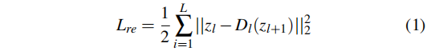
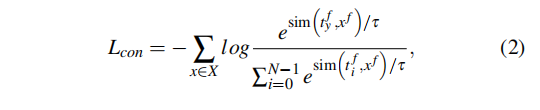
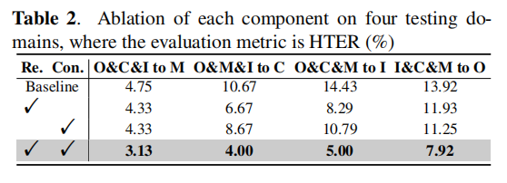

# VL-FAS  Domain Generalization via Vision-Language Model For Face Anti-Spoofing

[[paper](https://ieeexplore.ieee.org/abstract/document/10448156)]

## Introduction

这篇论文提出了一种名为VL-FAS的面部反欺骗（FAS）新方法，通过结合视觉变换器（ViT）和自然语言描述来提升模型在不同领域间的泛化能力。研究者们利用MiniGPT-4生成细致的面部区域描述作为引导，通过自上而下的注意力调节机制让模型集中学习面部特征，同时引入样本级视觉-文本优化模块（SLVT），借助对比学习加深模型对图像样本内在语义的理解，减少对特定领域信息的依赖。

## Method

### 任务导向的文本生成与注意力调节机制

使用MiniGPT-4模型生成针对面部区域的自然语言描述。这些描述作为“教师”，引导模型关注面部的关键特征。将生成的文本描述编码成文本特征，并将其与视觉特征结合。通过计算文本特征与视觉特征之间的余弦相似性矩阵，对视觉特征进行加权，以增强与文本描述相关的面部区域特征，并抑制不相关的特征部分。

### 样本级视觉-文本优化（SLVT)

构建样本级图像-文本对，并通过对比学习的方式，让视觉编码器学习如何从文本中提取与图像样本相关的内在语义信息。这有助于模型在特征空间中缩小视觉和文本特征之间的差距。

### 对比学习与损失函数

在特征空间中，通过最小化样本级图像和文本对之间的距离，同时最大化不同样本对之间的距离，来优化模型的泛化能力。定义了一个综合损失函数，结合了重建损失（用于注意力调节）、对比损失（用于样本级视觉-文本优化），以及分类损失（用于ViT的分类特征）。这个损失函数用于整体优化模型。

## Performance

